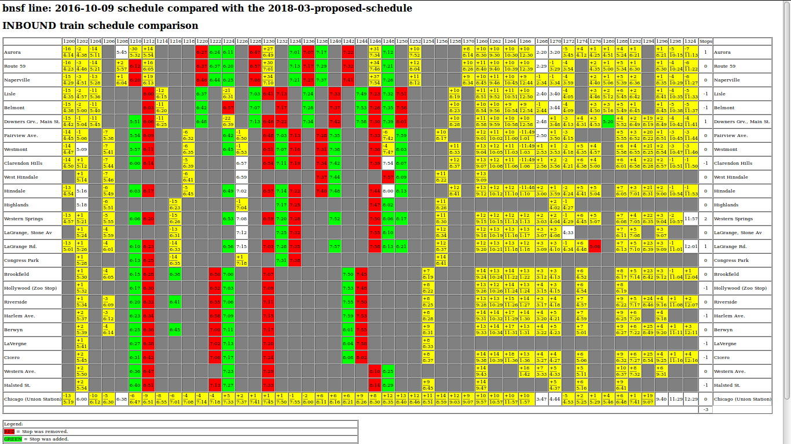

# Metra Schedule Diff Tool

A tool to compare two Metra schedules.  This comes handy when evaluating a proposed schedule against the current schedule.

## Schedule data

Schedule data is stored in the following directory hierarchy: `schedules/<metra line>/<schedule effective date>`.  For example, the schedule for the BSNF line, effective October 9th, 2016, is stored in `schedules/bnsf/2016-10-09`.

The data is stored in a CSV file for each train.  The CSV file is named after the train number.

A list of trains is kept in `schedules/<metra line>/inbound-trains.txt` and `schedules/<metra line>/outbound-trains.txt`. 

## Entering a schedule

Currently, entering a schedule is done by running the entrypoint in `TrainEntry` class.

## Comparing schedules

Comparing a schedule is done by running the entrypoint in the `ScheduleDiff` class.  The HTML files for the report are saved to the `target` directory, named `<direction>-diff.html`.

## Other interesting projects

* [open-city/metra-service-changes](https://github.com/open-city/metra-service-changes) - a [much cooler visualization](https://c82.net/metra/) than this project, prepared for the Metra Schedule Cuts in 2012.
* [blakesmith/metra\_schedule](https://github.com/blakesmith/metra_schedule)
* [pushchris/metra](https://github.com/pushchris/metra)
* [iandees/metraapi](https://github.com/iandees/metraapi)
* [jhartwell/ExMetra](https://github.com/jhartwell/ExMetra)
* [chadn/mct](https://github.com/chadn/mct)
* [SMASH1337/MetraAPI](https://github.com/SMASH1337/MetraAPI)
